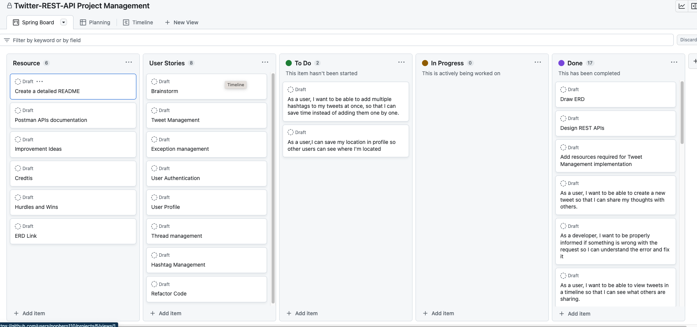

# Twitter REST APIs Spring Boot Application
**Developer**: Jeff Ou  
**Description**: This is a backend-only application that provides REST APIs with functionalities similar to Twitter's backend, allowing users to perform actions such as *creating, updating, and deleting tweets, creating profile, replying to a tweet,  searching for tweets, and adding hashtags*.
# Table of Contents

- [Technologies](#technologies) 
- [Project Dependencies](#project-dependencies)
- [Project Management](#project-management)
- [API Reference](#api-reference)
  - [Postman Workspace](#postman-workspace)
- [Wins](#wins)
- [Improvement Ideas during development](#improvement-ideas-during-development)
- [Credits](#credits)

# Technologies
**GitHub Project**: resource management  
**IntelliJ**: development IDEA  
**[Draw.io](https://drive.google.com/file/d/1KQNFfVow5GVSpBJ-qKArLaxjQkaPVNiU/view?usp=sharing)**: Create Entity Relationship Diagram  
**[Postman](https://www.postman.com/jeffou-1/workspace/twitter-like-restful-api-web-application)**: APIs Testing and Documentation  
**PgAdmin 4**: PostgresSQL GUI  
**Sourcetree**: Git GUI  

# Project Dependencies
- spring-boot-starter-web
  - for building web applications using Spring MVC
- spring-boot-starter-data-jpa
  - for using Spring Data JPA with Hibernate as the underlying implementation.
- postgresql
  - for working with PostgresSQL databases.
- spring-boot-starter-security
  - for securing web applications using Spring Security.
- jjwt-api
  - for creating and parsing JSON Web Tokens (JWTs).
- jjwt-impl
  - implementation of JSON Web Tokens (JWTs).
- jjwt-jackson
  - for handling JSON serialization and deserialization of JWTs.
- spring-boot-starter-validation
  - provides support for Bean Validation API (JSR 380) and Hibernate Validator

# Project Management

## [Brainstorm](https://github.com/users/pophero110/projects/5/views/2?pane=issue&itemId=26910994)
1. **Determine what kind of application I want to build**
2. **Identify the entities that are relevant to the domain**
3. **Use ERD to visualize the relationship between the entities and include the attributes associated with each entity**
4. **Design RESTful APIs**
5. **Create user stories**
6. **Determine Development Process**
## [Planning](https://github.com/users/pophero110/projects/5/views/5)
*User stories order by priority*
- [Tweet Management](https://github.com/users/pophero110/projects/5/views/2?pane=issue&itemId=26852053)
- [Exception Management](https://github.com/users/pophero110/projects/5/views/2?pane=issue&itemId=26916819)
- [User Authentication](https://github.com/users/pophero110/projects/5/views/2?pane=issue&itemId=26832640)
- [User Profile](https://github.com/users/pophero110/projects/5/views/2?pane=issue&itemId=26832800)
- [Thread Management](https://github.com/users/pophero110/projects/5/views/2?pane=issue&itemId=26834733)
- [Hashtag Management](https://github.com/users/pophero110/projects/5/views/2?pane=issue&itemId=26852063)

# API Reference
## User

| Request Type | URL               | Functionality | Access | Request Body        |
|--------------|-------------------|---------------|--------|---------------------|
| POST         | /auth/users       | Register      | Public | { email, password } |
| POST         | /auth/users/login | Login         | Public | { email, password } |            

## Tweet
| Request Type | URL                      | Functionality             | Access  | Request Body |
|--------------|--------------------------|---------------------------|---------|--------------|
| GET          | /api/tweets              | Get all tweets            | Private |              |
| GET          | /api/tweets/users/userId | Get a user's tweets       | Private |              |
| GET          | /api/tweets/me           | Get current user's tweets | Private |              |
| POST         | /api/tweets              | Post a tweet              | Private | { content }  |
| GET          | /api/tweets/tweetId      | Get a specific tweet      | Private |              |
| PUT          | /api/tweets/tweetId      | Update a tweet            | Private | { content }  |
| DELETE       | /api/tweets/tweetId      | Delete a tweet            | Private | { content }  |

## Thread
| Request Type | URL                         | Functionality           | Access  | Request Body |
|--------------|-----------------------------|-------------------------|---------|--------------|
| POST         | /api/threads/tweets/tweetId | Reply to a tweet        | Private | { content }  |
| GET          | /api/threads/threadId       | Get tweet from a thread | Private |              |   

## Profile

| Request Type | URL                  | Functionality        | Access  | Request Body          |
|--------------|----------------------|----------------------|---------|-----------------------|
| POST         | /api/profiles        | Create a profile     | Private | { name, description } |
| PUT          | /api/profiles        | Update a profile     | Private | { name, description } |
| GET          | /api/profiles/userId | Get a user's profile | Private |                       |

## Hashtag

| Request Type | URL                          | Functionality            | Access  | Request Body    |
|--------------|------------------------------|--------------------------|---------|-----------------|
| POST         | /api/tweets/tweetId/hashtags | Add a hashtag to a tweet | Private | { hashtagName } |
| GET          | /api/tweets/search?hashtags= | Get tweets by hashtags   | Private |                 |
| GET          | /api/hashtags/trending       | Get trending hashtags    | Private |                 |
## [Postman Workspace](https://www.postman.com/jeffou-1/workspace/twitter-like-restful-api-web-application)

# Wins
### Learn new ways to refactor code
- Refactor LonginResponse class with Record class
- Refactor If-Else statement with Optional orElseThrow and ifPresent method
- Use [@ControllerAdvice](./src/main/java/com/jeffdev/twitterapi/exception/GlobalExceptionHandler.java) to handle exceptions from controllers
### Learn how to use GitHub Project to manage resource

### Learn two ways of implement a many-to-many relationship in Spring Boot
- many-to-many annotation and a new entity or a composite key

# Improvement Ideas During Development
- Validate user's input in Controller level
- Optimize query performance such as users and tweets
- Refactor getCurrentLoggedInUser
- Refactor code using Intellij Code Inspection
- Implement APIs automated testing

# Credits

- **An [article](https://www.baeldung.com/spring-response-entity) that explains what is ResponseEntity and how to use it**
  - *ResponseEntity represents the whole HTTP response: status code, headers, and body*

- **An [article](https://www.baeldung.com/spring-request-response-body) that explains what is @requestbody annotation**
  - *the @requestbody annotation maps the HttpRequest body to a transfer or domain object, Spring automatically deserializes the JSON into a Java type*

- **An [article](https://www.baeldung.com/java-jsonignore-vs-transient) that explains what is @JsonIgnore annotation**
  - *We use the @JsonIgnore annotation to specify a method or field that should be ignored during serialization and deserialization processes. This marker annotation belongs to the Jackson library.*

- **An [article](https://www.developer.com/java/java-record-class/#:~:text=Record%20is%20a%20special%20purpose,added%20into%20the%20Java%20language) that explains what is Record class and how to use it
  - *A record is a new type of class introduced in Java 16 that is designed to represent simple, immutable data containers. Records provide a concise way to declare classes that are primarily used to store data, by eliminating boilerplate code that is typically required in traditional Java classes such as constructors, getters, and equals/hashCode implementations.* **Used on [LoginResponse](https://github.com/pophero110/Twitter-REST-API/commit/f4d60683c5305aa8c2f692c23823fb70bee79eb8) class**

- **An [article](https://www.bezkoder.com/jpa-many-to-many/)** that explains how to implement a many-to-many relationship and create operation. Used on Tweet and Hashtag tables

- The **Code Inspection** feature in IntelliJ saved me a lot of time in refactoring the code
